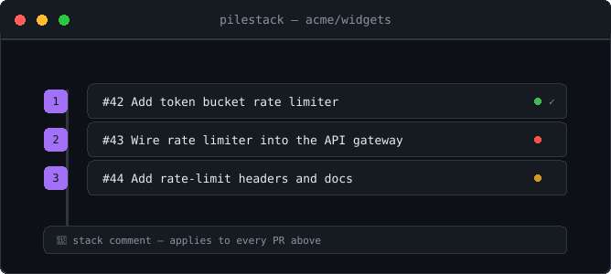
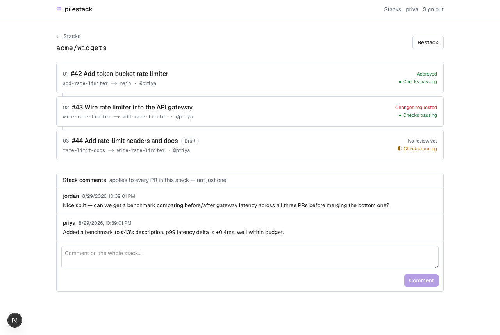
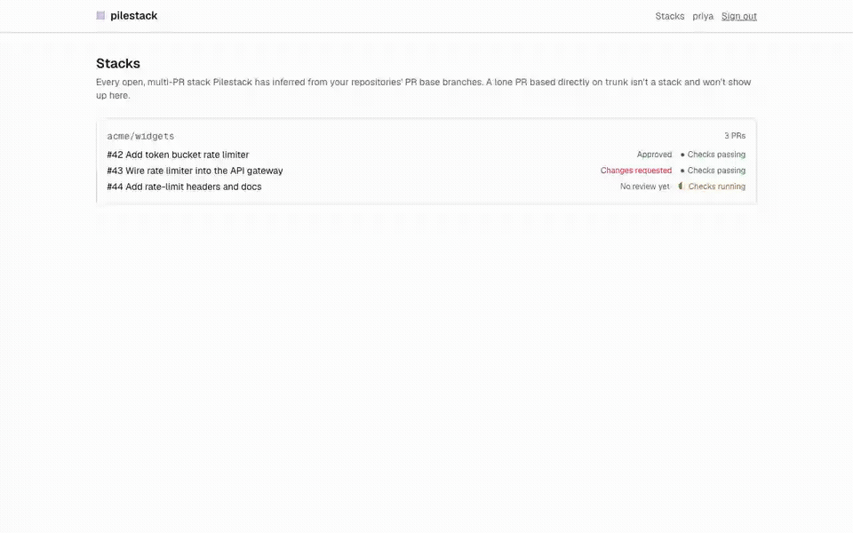

<div align="center">



**pilestack** — a shared review surface for stacked pull requests, the piece
[Graphite](https://graphite.dev) charges $20–40/user/month for. A self-hosted
GitHub App: infers stacks straight from your repo's open PRs, gives your team
one screen to review the whole stack — cross-PR comment threads, live
CI/review status per PR — and a one-click restack that's just real `git
rebase` with a confirmation step, not a reimplementation of one.

[](https://github.com/Laaaaksh/pilestack/stargazers)
[](https://github.com)

[](https://github.com/Laaaaksh/pilestack/actions/workflows/ci.yml)
[](https://github.com/Laaaaksh/pilestack/releases)
[](LICENSE)
[](package.json)

**[Install](#install) • [Usage](#usage) • [Configuration](#configuration) • [Limits](#limits) • [Changelog](CHANGELOG.md) • [Contributing](CONTRIBUTING.md) • [License](LICENSE)**

**[Code of conduct](CODE_OF_CONDUCT.md) • [Contributing](CONTRIBUTING.md) • [License](LICENSE) • [Security](SECURITY.md)**



</div>

## What it does

- Infers stacks straight from each PR's base branch — works with a
  `git-spice`- or `git-town`-managed stack, or one you built by hand, with
  zero CLI-specific integration
- Shows a stack in dependency order, bottom to top, with live CI and review
  status per PR
- Cross-PR stack comments: post once, see it on every PR in the stack — the
  one thing GitHub's own PR view has no equivalent for
- One-click **Restack**: rebases and `git push --force-with-lease`s every
  branch in order, with a mandatory diff preview before anything is pushed,
  and stops cleanly at the first conflict instead of leaving a silent partial
  push
- GitHub OAuth sign-in — stack visibility follows the viewer's real GitHub
  repo permissions, not a second set of roles to administer
- Self-hosted: SQLite by default, one Docker container, no per-seat billing
  and no telemetry

## Why Pilestack

The open-source stacked-diff CLIs — `git-spice`, `git-town`,
`git-branchless`, Meta's Sapling — are all excellent at managing a stack
locally, but none of them give a team a shared, web-based review screen: a
reviewer still clicks through PRs one at a time on GitHub. Pilestack is that
missing screen: it reads the stack your existing free CLI already created
(or one you built by hand) and adds the part CLI tooling can't provide
alone — a shared place to see and discuss the whole stack together. It isn't
a full Graphite replacement — no merge queue, no AI-generated reviews, no
enterprise SSO/audit log — see [Limits](#limits) for what that means in
practice.

## Requirements

- Node.js 20.9+ (or Docker — see [Install](#install))
- A GitHub organization or account where you can create a
  [GitHub App](https://docs.github.com/en/apps) and an
  [OAuth App](https://docs.github.com/en/apps/oauth-apps) — both free, no
  GitHub Enterprise required
- SQLite (the default — no setup) or your own Postgres, if you'd rather

## Install

### 1. Create the GitHub App

This is what lets Pilestack read PRs and push restacked branches on your
behalf. At **Settings → Developer settings → GitHub Apps → New GitHub App**:

- **Webhook URL**: `https://<your-pilestack-host>/api/webhooks/github`
- **Webhook secret**: generate one (`openssl rand -hex 32`) — you'll reuse it
  as `GITHUB_WEBHOOK_SECRET`
- **Repository permissions**: Pull requests (Read & write), Checks
  (Read-only), Contents (Read & write — needed to push restacked branches),
  Metadata (Read-only)
- **Subscribe to events**: Pull request, Pull request review, Check suite,
  Installation, Installation repositories
- After creating it, generate a private key and download the `.pem` file,
  and note the **App ID**

Install the app on the repositories you want Pilestack to watch.

### 2. Create the GitHub OAuth App

This is what lets your team sign in. At **Settings → Developer settings →
OAuth Apps → New OAuth App**, set the callback URL to
`https://<your-pilestack-host>/api/auth/callback/github`, then note the
**Client ID** and **Client secret**.

### 3. Run Pilestack

**Docker Compose (recommended):**

```bash
git clone https://github.com/Laaaaksh/pilestack.git
cd pilestack
cp .env.example .env   # fill in the values from steps 1–2
docker compose up -d
```

This builds the image locally (`build: .` in `docker-compose.yml`) — no
published image required. A pre-built `ghcr.io` image will be available as
the `image:` alternative in that file once a tagged release has been cut;
until then, use the command above as shown.

**From source:**

```bash
git clone https://github.com/Laaaaksh/pilestack.git
cd pilestack
pnpm install
cp .env.example .env   # fill in the values from steps 1–2
pnpm db:deploy
pnpm db:generate
pnpm build && pnpm start
```

## Usage

Once running and the GitHub App is installed on a repository:

1. Open two or more PRs where one's base branch is another's head branch
   (exactly what `git-spice`, `git-town`, or `gh pr create --base <branch>`
   already produce).
2. Visit your Pilestack URL and sign in with GitHub.
3. The stack shows up under **Stacks** — click in to see every PR in
   dependency order.
4. Leave a comment on the stack, or click **Restack** to preview and confirm
   a rebase across the whole stack.

Want to see the UI before wiring up a real GitHub App? `pnpm seed` loads a
realistic sample stack into your local database so `pnpm dev` has something
to show immediately.



## Configuration

All configuration is environment variables — see
[`.env.example`](.env.example) for the full list with explanations. The
short version:

| Variable | Purpose |
| --- | --- |
| `DATABASE_URL` | SQLite file path by default; point at Postgres instead if you prefer |
| `GITHUB_APP_ID`, `GITHUB_APP_PRIVATE_KEY_PATH`, `GITHUB_WEBHOOK_SECRET` | The GitHub App from [Install](#install) step 1 |
| `GITHUB_OAUTH_CLIENT_ID`, `GITHUB_OAUTH_CLIENT_SECRET` | The OAuth App from step 2 |
| `AUTH_SECRET` | Session signing secret — generate with `openssl rand -base64 33` |
| `NEXTAUTH_URL` | The public URL Pilestack is served from |

## Limits

- GitHub only — no GitLab, Bitbucket, or other forge.
- No merge queue and no AI-generated review comments; use GitHub's own merge
  queue alongside Pilestack if you need one. Restack is a real `git rebase` +
  `--force-with-lease` — a conflict stops the whole chain for you to resolve
  by hand, it does not auto-resolve.
- No release has been tagged yet, so there's no pre-built `ghcr.io` image —
  Docker Compose builds the image locally (see [Install](#install)), and the
  Release badge above will read "no releases found" until the first tag
  ships.
- The webhook signature check and the multi-branch rebase engine have both
  been independently exercised against real requests and real git
  repositories. Full GitHub OAuth sign-in and a live webhook delivery from an
  installed GitHub App have not been verified end-to-end — if you wire up a
  real installation, you may be the first to hit the rough edges there.
- `src/lib/github-app.ts` (the installation-token exchange) is covered by
  tests against a mocked GitHub API, not a live one.

## Changelog

See [CHANGELOG.md](CHANGELOG.md).

## Contributing

See [CONTRIBUTING.md](CONTRIBUTING.md) for the development workflow, what the
test suite actually covers, and the release process.

## Security

See [SECURITY.md](SECURITY.md) for how to report a vulnerability privately.

## Star this repo

If Pilestack is useful to you, [starring it](https://github.com/Laaaaksh/pilestack/stargazers)
helps other teams paying for the same thing find it.

## License

[MIT](LICENSE)
